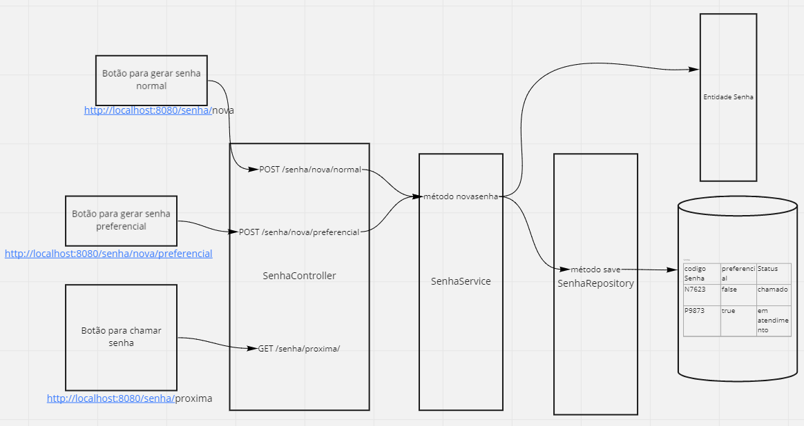

## Sobre
```
 Sistema para gestão de senhas.
 Contém uma API para gerar e chamar senhas- em conjunto com front-end comporá um  
 sistema para controle de atendimento a clientes com opção de senha preferencial,
 de chamada prioritária.
```

## Arquitetura
<p align="center">  </p>

## Status
```
 Back-end : API em andamento.
 Front-end: a desenvolver.
```

## Endpoints
```
° POST /nova/senha/Normal – Criar senha normal
° POST /nova/senha/Preferencial – Criar senha preferencial
° GET /senha/proxima – Mostrar senhas seguintes
```

## Tecnologias adotadas
```
-Java -  programação server-side
-SpringBoot - criação API Restfull e microsserviços
-Spring Data JPA - persistência de dados
-Maven - gestão de dependências, build automatizado,   execução testes
-Tomcat- servlet Java
-Angular - programação client-side
```


